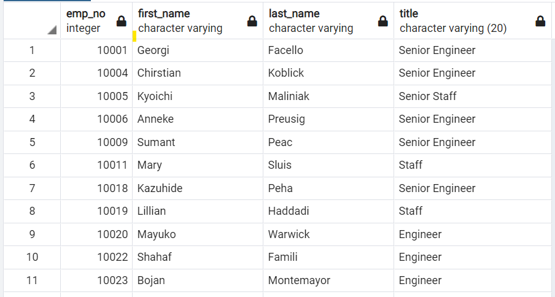
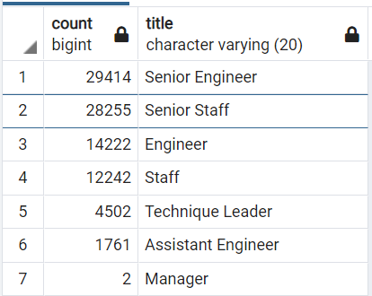
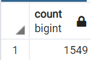
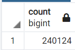

# Pewlett-Hackard-Analysis
Utilize SQL to analyze the company's employee data 

## Overview of the Project
Using SQL, organize the employee data represented in several CVS files to determine the number of retiring employees per title, and identify employees who are eligible to participate in a mentorship program. 

1. The Number of Retiring Employees by Title
2. The Employees Eligible for the Mentorship Program

Then, based on the tables generated from Postgres, we will list up the numerical observation we can draw from the tables and answer several key questions of how the company should react to this upcoming "silver tsunami" of retirements.
## Resources
- Data Source: departments.csv, dept_emp.csv, dept_manager.csv, employees.csv, salaries.csv, titles.csv
- Output Data: retirement_titles.csv, unique_titles.csv, retiring_titles.csv, mentorship_eligibility.csv
- Saved Query: Employee_Database_challenge.sql
- Software: Postgres, pdAdmin 4

## Results
  Based on the two technical analysis and tables generated using Postgres, we can infer below observations:
  
  1. The number of retirement we can expect is **90,398** based on the fact that these employees were born between January 1, 1952 and December 31, 1955.
  
      
  ```
    SELECT
      e.emp_no,
      e.first_name,
      e.last_name,
      ti.title,
      ti.from_date,
      ti.to_date
    INTO retirement_titles
    FROM employees as e
    INNER JOIN titles as ti
    ON (e.emp_no = ti.emp_no)
    WHERE (e.birth_date BETWEEN '1952-01-01' AND '1955-12-31')
    ORDER BY e.emp_no ASC;

    -- Use Dictinct with Orderby to remove duplicate rows
    SELECT DISTINCT ON (emp_no) 
      r.emp_no,
      r.first_name,
      r.last_name,
      r.title
    INTO unique_titles
    FROM retirement_titles as r
    ORDER BY r.emp_no ASC, r.to_date DESC;
  ```
   Then, we run the query to count the `emp_no` of the generated `unique_titles` table. This table skips duplicate `emp_no` that may have occured in `dept_employees` table due to event like promotion.
  
  ```
  SELECT COUNT(emp_no) FROM unique_titles;
  ```
  2. The following table `retiring_title` represents the number of retiring employees by their title. From the table, we can observe that top 2 retiring titles by the number are `Senior Engineer` and `Senior Staff`, which are **29,414** and **28,255** respectively. Those numbers double the number of employees retiring with `Engineer` and `Staff` titles. These tendency do make sense as we can infer that retiring employees must have working for long years and thus had more chance to be promoted.
   Therefore, we can observe that this "silver tsunami" of retiring is impacting more on the senior level employees and thus more concerning as the company will lose more experienced team.

      
       
  3. Then we utilized Postgres to filter `employees` data to draw employees who are born between January 1, 1965 and December 31, 1965 and also currently working using the below query;
  ```
  SELECT DISTINCT ON(emp_no)
    e.emp_no,
    e.first_name,
    e.last_name,
    e.birth_date,
    de.from_date,
    de.to_date,
    ti.title
  INTO mentorship_elig
  FROM employees as e
  INNER JOIN dept_employees as de
  ON (e.emp_no = de.emp_no)
  INNER JOIN titles as ti
  on (e.emp_no = ti.emp_no)
  WHERE (e.birth_date BETWEEN '1965-01-01' AND '1965-12-31')
  AND (de.to_date = '9999-01-01')
  ORDER BY e.emp_no ASC;
  ```
  
  4. Using the `COUNT(emp_no)` query on the newly generated `mentorship_elig` table, we learn that the number of mentorship-eligible employees is only **1,549**.

      
  
  The query run is as below;
  ```
  SELECT COUNT(emp_no) FROM mentorship_elig;
  ```
## Summary
   Based on the results, I will respond to following two quetions in response to the upcoming "silver-tsunami" that we can expect from the technical analysis.

  1. How many roles will need to be filled as the "silver tsunami" begins to make an impact?
    
     + Given **90,398** employees are expected to retire soon, let us measure how impactful that is to the company by calculating the current head  count.
     + We can do so by generating a new table on Postgres that displays the currently employees, which is similar to what we did before without filtering by `birth_date` but ensure filtering by `to_date` as below query shows;
     ```
     SELECT DISTINCT ON(emp_no)
        e.emp_no,
        e.first_name,
        e.last_name,
        e.birth_date,
        de.from_date,
        de.to_date,
        ti.title
     INTO current_emp2
     FROM employees as e
     INNER JOIN dept_employees as de
     ON (e.emp_no = de.emp_no)
     INNER JOIN titles as ti
     on (e.emp_no = ti.emp_no)
     AND (de.to_date = '9999-01-01')
     ORDER BY e.emp_no ASC;
     ```
     Then run another query to count the number of `emp_no` of the new `current_emp2` table as below;
     ```
     SELECT COUNT(emp_no) FROM current_emp2;
     ```
     
     + Now we learn that current head count is 24,0124 and 90,398 is equivalent to **37.64%**
 
     + Also, we run queries to identify which employee titles are impacted most from the upcoming retirment;
   
    SELECT 
      e.emp_no,
      e.first_name,
      e.last_name,
      e.birth_date,
      de.from_date,
      de.to_date
    INTO current_emp2
    FROM employees as e
    INNER JOIN dept_employees as de
    ON (e.emp_no = de.emp_no)
    WHERE (de.to_date = '9999-01-01')
    ORDER BY e.emp_no ASC;

    -- Join with 'titles' table
    SELECT
      ce.emp_no,
      ce.first_name,
      ce.last_name,
      ti.title,
      ti.from_date,
      ti.to_date
    INTO current_emp_titles
    FROM current_emp2 as ce
    INNER JOIN titles as ti
    ON (ce.emp_no = ti.emp_no)
    ORDER BY ce.emp_no ASC;

    -- Use Dictinct with Orderby to remove duplicate rows
    SELECT DISTINCT ON (emp_no) 
      cet.emp_no,
      cet.first_name,
      cet.last_name,
      cet.title
    INTO current_unique_titles
    FROM current_emp_titles as cet
    ORDER BY cet.emp_no ASC, cet.to_date DESC;

    -- Display the number of current employees by title
    SELECT COUNT (cut.emp_no), cut.title
    INTO count_current_titles
    FROM current_unique_titles as cut
    GROUP by cut.title
    ORDER by count DESC;

    SELECT * FROM count_current_titles;
    

    From the queries run, we can find two tables comparing the number of retirement by title and the number of current employees by titles:
    *** Currnet
  
  2. Are there enough qualified, retirement-ready employees in the departments to mentor the next generation of Pewlett Hackard employees?
    
     + Based 

     + In order to 
  
